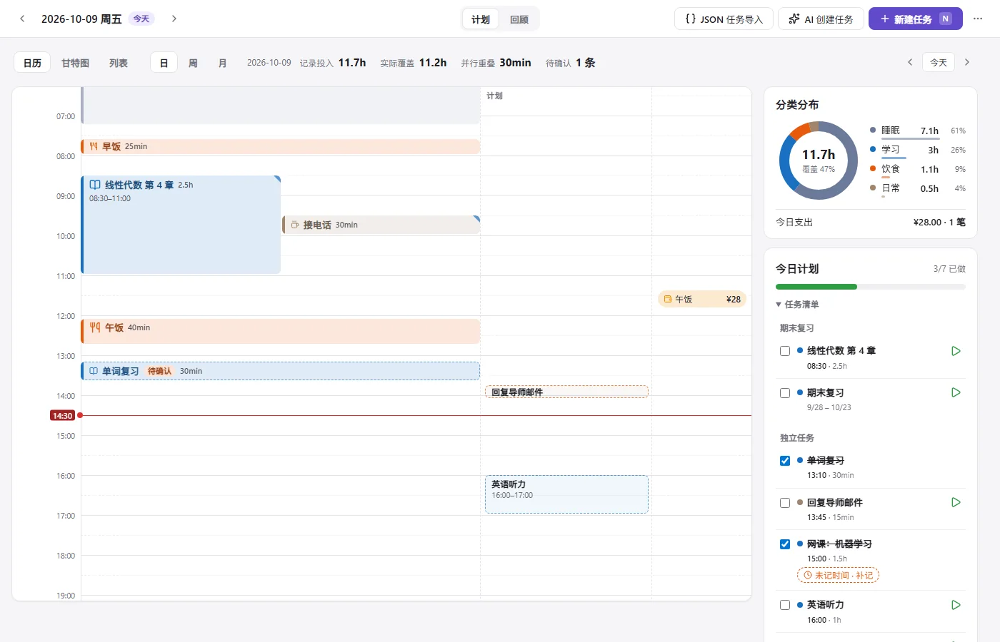
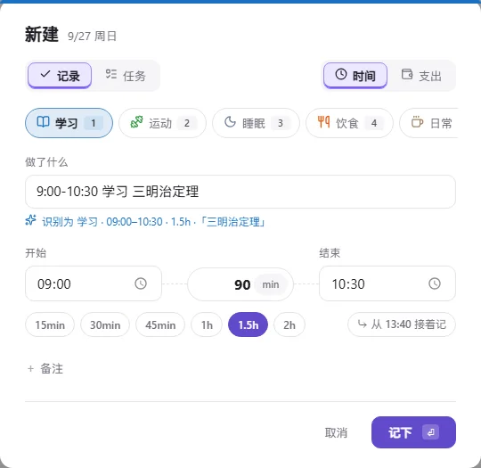
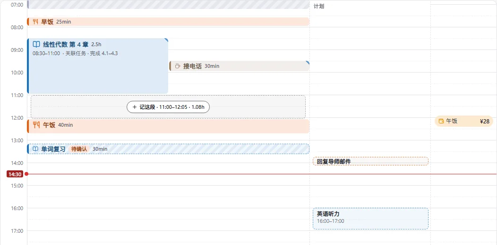
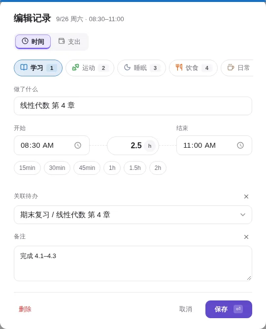
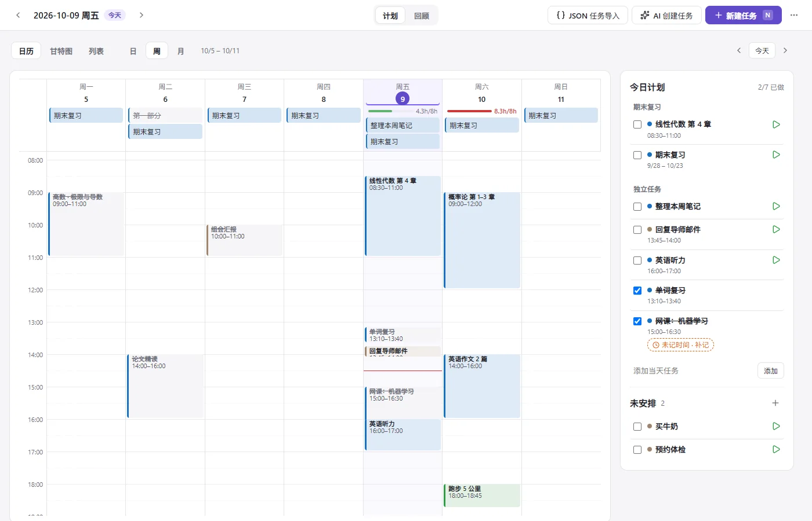
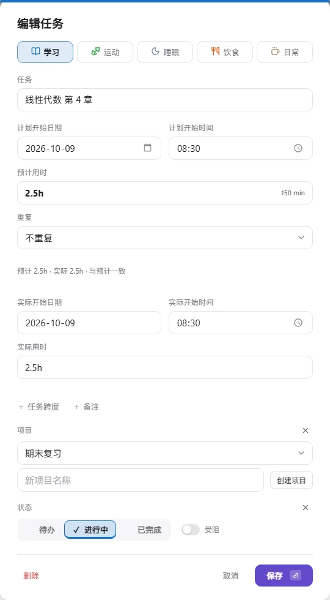
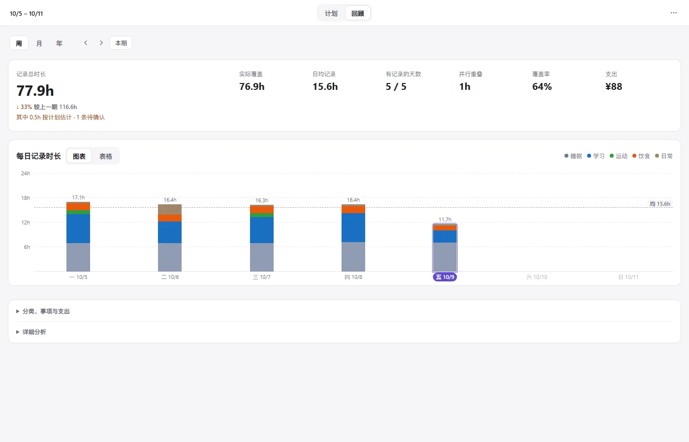
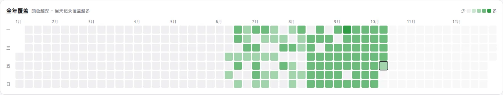
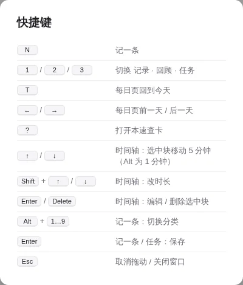

# Lubi 教学手册

> 适用版本：Lubi v1.6.0 ｜ 读完约 15 分钟，跟着做完「第一周练习」就能用顺手。
> 截图只使用合成示例数据；部分旧总览图保留 v1.5，操作流程以本文说明为准。

Lubi 是一个 Obsidian 插件，用**柳比歇夫时间统计法**管理时间：做完一件事就记下「几点到几点、做了什么」，每周 / 每月回头算账，看时间到底花在哪儿，再据此安排明天。

整个插件只有三页；当前界面的「计划」就是下文的任务页：

| 页面 | 用途 | 一句话 |
|---|---|---|
| **每日** | 记下已经发生的时间，对照当天计划 | 记一条 |
| **回顾** | 按周 / 月 / 年汇总 | 看一眼 |
| **任务** | 安排接下来要做的事 | 排一下 |

---

## 目录

1. [[#1. 打开 Lubi|打开 Lubi]]
2. [[#2. 认识界面|认识界面]]
3. [[#3. 每日页：记下时间|每日页：记下时间]]
4. [[#4. 任务页：安排明天|任务页：安排明天]]
5. [[#5. 回顾页：月末算账|回顾页：月末算账]]
6. [[#6. 记支出|记支出]]
7. [[#7. 数据存在哪里|数据存在哪里]]
8. [[#8. 设置|设置]]
9. [[#9. 快捷键速查|快捷键速查]]
10. [[#10. 第一周练习|第一周练习]]
11. [[#11. 常见问题|常见问题]]

---

## 1. 打开 Lubi

- 点左侧栏的 **沙漏图标 ⌛**（提示文字「Lubi 记录」）。
- 或 `Ctrl+P` 打开命令面板，输入 `Lubi`：

| 命令 | 作用 |
|---|---|
| `Lubi: 打开面板` | 打开 Lubi |
| `Lubi: 新建（记录 / 任务）` | 不开面板，直接弹出新建窗口（顶部可在「记录 / 任务」间切换） |
| `Lubi: 打开面板 · 每日页 / 回顾页 / 任务页` | 直接打开到指定页 |
| `Lubi: 打开今天的日记文件` | 打开今天的 Markdown 日记 |
| `Lubi: 导出全部记录为 CSV` | 导出记录字段，文件保存到 Vault 根目录 |

> 小技巧：在 Obsidian「设置 → 快捷键」里搜 `Lubi: 新建`，绑一个全局快捷键（比如 `Ctrl+Shift+L`），在任何笔记里都能随手记。

没有历史记录时，每日页显示一行入门提示；点击右上角「记一条」开始，提示旁的 × 可以关闭。


---

## 2. 认识界面


顶栏分三块，**三个页签的位置固定不动**，切页时不会跳：

- **左**：`‹ 日期 ›`。每日页 / 任务页显示当前日期（今天会带「今天」徽标），两页共用同一个日期，一边翻天另一边跟着走；回顾页显示当前周期，如「回顾 · 9/21 – 9/27」。
- **中**：`每日 · 回顾 · 计划` 三个页签（计划即任务页），也可以按 `1` `2` `3` 切换。
- **右**：新建按钮（快捷键 `N`）——每日 / 回顾页是 `＋ 记一条`，任务页是 `＋ 新建任务`；以及 `⋯` 菜单（打开日记文件 / 导出 CSV / 快捷键 / 设置；计划页另有 AI 创建任务）。

面板很窄时（例如放在侧栏），页签只显示图标，内容自动改成单列。

---

## 3. 每日页：记下时间



左边是当天的 **24 小时时间轴**：每条记录按开始时间落位，**高度 = 时长，颜色 = 分类**。当天定了开始时间的任务画在时间轴右侧的虚线 **「计划」列**，计划和实际一眼对照。右边是侧栏：分类分布（环形图 + 覆盖率 + 支出）直接显示在顶部，当天计划在下方的独立卡片中显示进度；空白时段默认展开，可点击收起。

### 3.1 记一条的六种方式

| 方式 | 怎么做 | 适合 |
|---|---|---|
| ① 按钮 | 点右上角 `＋ 记一条`，或按 `N` | 最常用 |
| ② 拖出来 | 在左侧记录区**空白处按住上下拖**出一段，松手 | 补记一段已知时间 |
| ②b 拖出计划 | 右侧计划列显示时，在该列空白处按住上下拖选，松手 | 默认打开计划表单，预填日期、开始时间和预计用时 |
| ③ 双击 | 双击时间轴空白处 | 从某个时刻开始记 |
| ④ 补记空白 | 鼠标移到一段空白上，点「记这段」 | 补上「时间黑洞」 |
| ⑤ 接着记 | 记录窗口里点「从 xx:xx 接着记」 | 连续做事时 |
| ⑥ 记任务实际时间 | 点右栏任务清单中未完成任务的 ▶ | 按计划做完了，记下实际时间 |

点击「计划」列里的虚线块，默认打开对应规划任务的编辑窗口；不会直接打开时间记录。

鼠标悬停的虚线和拖选高亮各自限制在记录区 / 计划区，不横跨两边。创建类型由按下鼠标的位置决定，拖动途中跨过分界线不会切换；按 `Esc` 或取消表单不写入数据。没有计划列时，整个空白区域仍用于记录。

每日页的虚线计划块也可以编辑：拖动块本身改开始时间；拉上边缘改开始并保持结束，拉下边缘改结束。默认按 5 分钟吸附，按住 `Shift` 精确到分钟，`Esc` 取消；松手同步任务，Notice 中可撤销。记录区与计划区拖动时的起止时间紧贴任务左侧，随任务移动或拉伸；起止时间单行显示，避开任务文字和刻度，取消后清除。只有点击并保存实际记录才完成任务。重复任务沿用任务页规则，调整计划时间会影响后续重复项，不改历史记录快照。

### 3.2 记录窗口



从上到下：

1. 顶部互斥选择 **记录时间 / 记录支出 / 规划任务**；切到规划任务就是新建任务（见 [[#4.3 编辑任务|4.3]]），支出见 [[#6. 记支出|第 6 节]]。
2. **分类**：点胶囊选，或按 `Alt+1…9`（胶囊上的小数字就是序号）。
3. **做了什么**：先点击或用键盘进入名称输入框，再写标题或选择同分类的历史名称。记录时间、支出和规划任务表单打开时不自动聚焦名称，也不自动展开候选。列表默认露出最近 5 条，其余滚动查看；输入“打”能筛出“打游戏”等名称。规划任务与编辑表单同样支持，只填名称，不带入旧日期、时长或状态；没有匹配时可直接输入新名称。最近使用顺序重启后保留，取消或只修改日期 / 时长 / 备注不会改变排序。
4. **开始 ── 时长 ── 结束**：三者联动，改任一个另外两个会跟着变。时长旁边的 `min` 点一下可以切换成 `h`。
5. **快捷时长**：15min / 30min / 45min / 1h / 1.5h / 2h，当前值会高亮。
6. **从 xx:xx 接着记**：把开始时间设为上一条记录的结束时间。
7. `+ 备注`：需要时再点开。关联任务不用手动选：从计划块、任务的 ▶ 或勾选完成记下的记录会自动关联。

按 `Enter` 或点「记下」保存。填得不对会在对应的框旁边提示，不会丢掉已填的内容。

### 3.3 一行快速记录（推荐）

在「做了什么」里**一行写完**，Lubi 会自动识别，并在下方提示「识别为 …」：

| 你输入 | 识别结果 |
|---|---|
| `9:00-10:30 学习 三明治定理` | 09:00 开始，90 分钟，分类「学习」，标题「三明治定理」 |
| `30min 跑步` | 30 分钟，标题「跑步」 |
| `1.5h 运动 游泳` | 90 分钟，分类「运动」，标题「游泳」 |
| `看书 1h30m` | 90 分钟，标题「看书」 |
| `45分钟 冥想` | 45 分钟，标题「冥想」 |
| `14:00 午饭` | 14:00 开始，标题「午饭」 |
| `23:00-01:00 睡眠 小睡` | 跨过午夜，120 分钟 |

规则：

- 时间段可以用 `-` `~` `到` `至` 连接，冒号中英文都可以。
- 时长支持 `min` / `分钟` / `h` / `小时` / `1h30m`。
- 分类名必须和你设置里的分类**完全一致**，而且后面还要有别的字。只写一个「学习」会被当成标题。
- 识别不出来就原样当标题，比如 `读《1984》`、`跑步 5km` 不会被误判。

### 3.4 补记「时间黑洞」



左侧记录区**超过 30 分钟的空白**，鼠标移上去会出现虚线框和「记这段 · 起–止 · 时长」按钮，点一下就会打开记录窗口，时间已经填好。柳比歇夫法的关键就是让空白越来越少。

### 3.5 修改、移动、删除

| 操作 | 方法 |
|---|---|
| 编辑 | 点一下记录块 |
| 移动（时长不变） | 按住块身上下拖 |
| 改开始 / 结束 | 拖块的上边缘 / 下边缘 |
| 精细吸附 | 默认吸附 5 分钟；拖动时按住 `Shift` 为 1 分钟，按住 `Alt` 吸附到相邻记录的边缘 |
| 取消拖动 | `Esc` 或右键 |
| 撤销 | 松手后右下角提示框里有 6 秒的「撤销」 |
| 键盘微调 | 点选一个块后 `↑` `↓` 移动 5 分钟（`Alt` 为 1 分钟），`Shift+↑/↓` 改时长 |
| 删除 | 选中后按 `Delete`，或在编辑窗口里点左下角「删除」（关联了任务时的同步规则见 [[#3.10 删除记录与任务同步|3.10]]） |



### 3.6 看懂时间轴

- **低饱和色块**：「背景时间」，默认是睡眠。它会显示并参与统计，但在视觉上降权，不跟学习、工作抢眼。哪些分类算背景时间可以在设置里改。
- **右上角蓝色小三角**：记录与别的记录时间重叠。顶部摘要显示并行重叠时长；记录投入相加，实际覆盖合并重叠区间，二者不混淆。
- **红线**：现在的时间。
- **虚线「计划」列**：悬停或聚焦显示编辑、删除两个图标；编辑打开任务表单，删除只取消当天计划（一次性任务清除排期，重复任务只跳过当天）。当天定了开始时间、还没完成的任务。过了计划时间还没记的会**标橙**。
- **虚线块 + 「待确认」徽标**：按计划自动记下的记录，还没确认实际时间（见 [[#3.9 待确认记录|3.9]]）。
- **「↑ 更早 N 条 / ↓ 更晚 N 条」**：上方或下方视野外还有记录，点一下滚过去。
- **右侧窄栏**：当天的支出记录。
- 块足够高时显示时间段；备注、关联任务和预计对比在悬停或键盘聚焦详情中查看。

### 3.7 右侧栏

- **分类分布（侧栏顶部，直接显示）**：各分类小时数和占比；环形图中间是总时长和覆盖率（记录覆盖了 24 小时中的多少）；底部一行是今日支出。
- **当天计划**：位于分类分布下方的独立卡片，显示「已做 / 计划数」和进度条。「任务清单」默认展开，按开始时间显示当天全部任务；未定时任务放在最后（含定时、未定时和已完成），可勾选完成、点标题编辑或点 ▶ 记实际时间；刷新进度时保留展开状态。
- **空白时段（默认展开）**：当天最长的几段空白，点时间在时间轴上定位，点 ＋ 直接补记。

> 每日页只负责「记」和「对照」，新建、排期任务都在任务页。

### 3.8 看其他日期

`‹` `›` 或键盘 `←` `→` 切换前一天 / 后一天，`T` 回到今天。历史日期同样可以拖动、补记、修改。

### 3.9 待确认记录

在任务页**勾选完成**一个任务（或在今日计划的任务清单中勾选）时，Lubi 会按计划时间直接在时间轴上记一条（没有计划时间就从此刻往前推预计时长），不弹窗。因为这是按计划估的、不是实际用时，它会显示为**虚线 + 「待确认」**，日记里多一个 `[待确认:: 按计划]` 字段。

变成正式记录的三种方式：

- 拖到实际的时间 / 拉成实际的时长；
- 打开编辑窗口保存一次；
- 鼠标悬停，点击块上的 **「待确认」标签**。

回顾页的记录总时长下会提示「其中 Xh 按计划估计 · N 条待确认」，提醒你别把估计当成实际。不想自动记，可以在设置里关掉「勾掉任务时自动记一条」。

### 3.10 删除记录与任务同步

在每日页删除一条**关联了任务**的记录，任务页会跟着同步：

| 关联的任务 | 删除记录后 |
|---|---|
| 一次性任务，且时间线上没有别的记录关联它 | 任务一起删除 |
| 一次性任务，但还有别的记录关联它 | 任务保留，只取消当天完成 |
| 重复任务 / 带子任务的项目 | 任务保留，只取消当天完成 |

右下角提示框里点「撤销」，记录、任务和完成状态会一起恢复。

---

### 3.11 预计与实际对比

从任务的 ▶ 打开记录窗口，有预计的任务会显示预计 / 本条实际 / 偏差。修改时长、结束时间或快捷时长时实时更新。例如预计 45min、实际 1h，会显示「超出 15min」。

预计作为 `[预计用时:: 45min]` 快照保存，之后修改任务不改变历史快照；实际仍用 `[时长:: …]`。时间轴保留标题、实际时长与时间段，悬停或键盘聚焦详情显示完整预计对比。没有预计或没有历史快照就不补算，待确认记录核对后再比较。

**这不是秒表。** 初始时长来自任务计划，保存前要按真实用时核对。当前偏差针对本条记录；同一任务分多次记录时，预计不能重复相加，也暂不提供累计任务偏差。

---

## 4. 任务页：安排明天



| 区域 | 内容 |
|---|---|
| 左上 **今天** | 今天的任务。底部输入框写标题后回车即可添加；勾选 = 完成（自动在时间轴记一条待确认记录，见 [[#3.9 待确认记录|3.9]]），取消勾选会把那条记录一起移除（可撤销）。任务行保留 **▶**：以此刻为开始预填一条关联记录；成功记下后任务自动完成，重复任务只完成当天。取消或记录写入失败不完成 |
| 左下 **未安排** | 还没定日期的任务。可直接拖到上方「今天」（或当前选中日）的清单，松手后安排为当天全天任务；也可点「日历+」按钮或拖到右边日程上。安排后可撤销 |
| 右侧 **周日程** | 以当前日期为中心的连续 7 天（前 3 天 · 当天 · 后 3 天）× 小时的日程表。`‹ ›` 每次翻 7 天，「今天」回到今天居中；点窗口内的某一天只是选中它，表格不跳 |
| 底部 **项目** | 有子任务的任务会自动成为项目，显示进度和时间跨度 |

### 4.1 在周日程上排期

- **拖动任务块**：上下拖改时间，左右拖换一天，拉下边缘改预计时长（吸附 15 分钟，`Esc` 取消）。
- **从左侧拖过来**：拖到某个时刻 = 定时任务；拖到表头 = 全天任务。
- **拖出新任务**：在空白处按住上下拖出一段，松手弹出新建任务，日期、开始时间和预计时长已填好（吸附 15 分钟，`Esc` 取消）。
- **双击空白**：在那个时刻新建任务。
- 排期后同样有「撤销」。
- 默认只显示 06:00–24:00，并非禁止凌晨任务。需要 6 点前的网格时，设置 →「日程显示时段」将起始小时改为 `0`，结束保持 `24`。

### 4.2 负载条：别把一天排太满

排了计划的日子，表头下有一根细条：**这天未完成任务的预计时长 ÷ 每日可用小时**（默认 8 小时，可在设置里改）。没排计划的日子不显示。

- 绿色：正常
- 橙色：≥ 90%，快满了
- 红色：超过 100%，排太满了，挪一些到别的日子

鼠标悬停可以看到具体数字，例如「计划 3.5h / 可用 8h」。

### 4.3 编辑任务



在任务页按 `N` / 点 `＋ 新建任务`，或在任何新建窗口顶部选择「规划任务」，就是新建任务；点任务标题或日程上的任务块是编辑。

- **分类、标题**。
- **重复**：不重复 / 每天 / 每周（选周几）/ 每月（选几号）。重复任务每次勾选只完成当天那一次。
- **安排日期、开始时间**：不填开始时间就是全天任务。
- **预计**：可以写 `2.5h`、`90min`、`1h30m` 或纯数字（分钟），右边会换算成分钟给你确认。
- `+ 父任务`：挂到某个项目下面。`+ 项目跨度`：设置项目的开始和截止日期。`+ 状态`、`+ 备注`。这些都是需要时再点开。
- **状态**：待办 / 进行中 / 已完成，**受阻** 是一个独立开关（例如在等别人）。
- 标题旁出现「● 未保存」表示有改动没保存；点「取消」不会写入，点「保存」或按 `Enter` 才写入。

### 4.4 父任务与子任务

规划页不再单独展示项目面板，已有父子关系、状态和起止日期仍保留。子任务继续在当天或未安排清单中按父任务分组；点击分组标题可编辑父任务，通过任务表单的「父任务」和「项目跨度」字段维护层级与起止日期。

---

#### 甘特图：日／周／月

任务列标题居中，名称左对齐；已完成任务名称划线、任务条变为灰色，取消完成恢复分类色。

在周日程区域点击 **甘特图**，入口不再分成“今日甘特”和“甘特图”。进入后用 **日 / 周 / 月** 切换；切换不会改任务数据，默认日视图，原周日程入口保留。

- **日**：所选日期的 00:00–24:00 横向时间线，每个任务一行，按开始时间排序。未定时任务不画全天横条，未填预计仅显示开始标记，跨午夜仅展示本日部分。
- **周**：所选日期所在的周一到周日，每列一天。
- **月**：所选日期所在的自然月，每列一天，自动处理 28 / 29 / 30 / 31 天。
- 日期按钮按当前视图前后移动一天、一周或一月，月末会落到目标月可用的日期；“今天”返回当前日期所在的时段。
- 完成任务用删除线表示，不额外添加勾号。点击任务名称或横条打开原有规划编辑表单。
- 日视图普通任务可横向移动开始时间、拉两端调整预计，默认 5 分钟吸附、Shift 精确到分钟；重复和跨日裁切条不直接拖动。
- 周／月视图普通单日任务可平移安排日期，也可拉左右端生成日期跨度；显式跨度可平移或伸缩，平移同步已有安排日，伸缩不把安排日排除在范围之外。父任务不自动带动子任务，汇总条与重复分段不直接拖动。
- Esc、右键和指针取消可放弃；保存后可撤销，并保留排期并发修改的保护。预计时长、日期操作不会改写历史实际记录。
- 窄屏在图内滚动，名称固定；不恢复独立项目面板，也不新增编辑弹窗。

---

### 4.5 跳过重复任务与 AI 创建

- 重复任务行的「跳过」仅跳过当天这一次，不改变重复规则。
- 在计划页「⋯」菜单选择「AI 创建任务」，先配置接口与模型，输入描述后得到草稿；确认主任务与每个子任务表单，保存才创建。取消未保存的表单不写入。
- 设置页可获取模型列表、手动选模型和测试连接。AI 是可选的；正常记录和排期不需要 AI。
- 云端会收到主动提交的描述、分类与日期上下文。API Key 目前保存在普通本地设置文件，且桌面 curl 兜底跳过证书校验，优先使用可信本地服务；不要将设置文件同步给别人或提交到 Git。

---

## 5. 回顾页：月末算账



右上角切换 **周 / 月 / 年**，`‹ ›` 切换上一期 / 下一期，「本期」回到当前。

### 5.1 指标卡

摘要区只展示一组指标：记录投入（各条时长相加）、实际覆盖（时间段合并），存在重叠时显示并行重叠。分类、事项和支出整合到下方折叠明细；本期摘要、计划与实际、未记录时段放在「详细分析」中，不默认铺开。不能把并行重复计时当作更多可用时间。

- **记录总时长**（大卡）：下面会显示和上一期相比多了还是少了多少；有待确认记录时还会提示「其中 Xh 按计划估计 · N 条待确认」。只有两期都有足够多的有效记录天数（周 ≥ 2 天、月 ≥ 5 天、年 ≥ 14 天），而且没有待校对的异常日时才显示，避免拿不完整的数据下结论。
- **有记录的天数**、**日均记录**（有异常日时显示「有效日均」，异常日不计入）。
- **覆盖率**：有记录的那些天里，记录覆盖了 24 小时的多少。
- **支出**。

### 5.2 异常提示

如果某天的记录跨出了当天，或者单日加起来超过 24 小时，页面顶部会出现一行橙色提示，后面跟着「校对 某日期」按钮，点一下直接跳到那天去修。柱状图上对应的柱子也会标 ⚠。

### 5.3 每日记录时长图

- 每根柱子是一天（年视图里是一个月），按分类堆叠。**睡眠这类背景时间固定在最底层**，方便比较上面的「有效时间」。
- 虚线 = 本期日均。
- 鼠标悬停或键盘聚焦时显示各分类的小时数；**点柱子跳到那天**（年视图里点某个月进入该月）。
- 「表格」按钮可以切换成表格，数字更精确，也方便读屏软件。

### 5.4 年热力图



年视图下多一张全年覆盖热力图：每个小格是一天，**颜色越深 = 那天记录覆盖得越多**。橙色描边 = 有待校对的记录，黑框 = 今天。点任意一格跳到那天。坚持得怎么样，一眼就能看出来。

### 5.5 明细

- **按分类**：各分类小时数和占比。
- **事项 Top 5**：花时间最多的 5 件事，保留次数，与分类明细使用一致的底轨和分类色进度条。
- **支出**：按类别汇总，外加最近 30 笔。

> 柳比歇夫的做法：每月末花半小时看回顾页，问自己三个问题：时间主要去了哪？和我想要的一致吗？下个月要调整什么？

---

## 6. 记支出

在记录窗口顶部选择 **记录支出**：填时间、金额、类别（餐饮、交通……类别可在设置里改）、标题。支出会显示在时间轴右侧的窄栏、今日支出，以及回顾页的「支出」卡片里。

---

## 7. 数据存在哪里

**所有数据都是保险库里的普通文件，可读、可手写、可同步**，不依赖任何云服务。

### 7.1 时间记录：`日记/YYYY-MM-DD.md`

每天一个 Markdown 文件。Lubi **只管理 `## 记录` 这一节**，其他地方你随便写（比如随笔、心得）：

```markdown
---
date: 2026-09-26
---

# 2026-09-26

## 记录
- 09:00–10:30 学习 · 三明治定理 [时长:: 1.5h]
- 12:10 财务 · 午饭 [金额:: 35] [类别:: 餐饮]
- 20:00–20:45 运动 · 跑步 [时长:: 45min] [备注:: 5 公里]

## 随笔
今天状态不错。
```

一行的格式：`- 开始[–结束] 分类 · 标题 [字段:: 值]…`

- 时长可写 `1.5h` 或 `90min`；没写 `时长` 字段时按起止时间算。
- 可选字段：`[备注:: …]`、`[任务:: 任务 id]`、`[预计用时:: 45min]`（任务预计快照）；支出用 `[金额:: …] [类别:: …]`。
- 在文件里手写一行并保存后，面板会自动刷新。
- 这些是 Dataview 内联字段，可以用 Dataview 自己写查询。
- 跨过午夜的记录会自动拆成两天，各记在各自的日记里。

### 7.2 任务：`任务/任务数据.json`

所有任务 / 项目 / 重复规则存在一个 JSON 文件里（schema v14）。仓库模板是空任务列表。一般不需要手动改；要改的话先禁用插件或关闭 Obsidian，并备份原文件。

要清空任务，将文件改为：

```json
{ "version": 14, "tasks": [] }
```

再启用插件。此操作不删除日记；旧记录可能保留历史任务 ID，界面不再显示已不存在任务的关联标签，实际时长与预计快照仍保留。私有备份应放在仓库外，不提交到 Git。

### 7.3 插件设置：`.obsidian/plugins/lubi/data.json`

删掉这个文件等于恢复默认设置。文件可能包含接口地址和明文 API Key，只保留在本地，不提交或分享；本仓库已忽略新设置文件。

### 7.4 CSV 导出

通过 `⋯ → 导出全部记录 CSV` 或同名命令导出；文件保存在 Vault 根目录，带 UTF-8 BOM。当前字段为日期、开始、结束、分钟、分类、标题、任务、金额、支出类别和备注；预计快照仍以 Markdown 字段为准，尚未扩展进 CSV 列。导出内容是个人数据，不提交到公共仓库。

---

## 8. 设置

`⋯` → **设置**，或在 Obsidian「设置 → 第三方插件 → Lubi」里打开。页面按「数据与日程 → 分类 → AI 任务创建 → 支出类别 → 数据维护」分区，修改后自动保存。AI 默认收起，仅显示当前模型；展开后在同一个模型输入框里手动填写或选择已获取的模型。

| 设置项 | 说明 |
|---|---|
| 日记文件夹 / 任务数据文件 / 备份文件夹 | 数据文件放在哪里 |
| 日程时间范围 | 用「从 / 到」整点选择，支持 00:00–24:00；结束时间应晚于开始 |
| AI 接口 / 模型 / API Key | 可选；获取模型、测试连接与创建草稿均需主动触发，安全限制见第 4.5 节 |
| 完成任务时自动记一条 | 完成任务后直接在时间轴生成一条待确认记录（按计划开始时间；没有则从此刻往前推预计时长），不弹窗，可撤销 |
| 每日可用小时 | 负载条的分母，默认 8 |
| **分类** | 桌面每类一行，共用名称 / 图标 / 颜色 / 背景 / 类型 / 操作表头；窄屏换行并显示字段标签 |
| 支出类别 | 餐饮、交通等 |
| 迁移旧版数据 | 把旧格式的日记转换成新格式 |
| 重新显示入门提示 | 没有历史记录时显示每日页的一行提示 |

> 颜色提示：如果某个分类的颜色和主题强调色（按钮、当前页签用的颜色）太接近，设置页会给出提醒，建议换一个颜色，免得分不清「数据」和「按钮」。

---

## 9. 快捷键速查

在 Lubi 面板里按 `?` 随时查看：



| 按键 | 作用 |
|---|---|
| `N` | 新建（每日 / 回顾页：记一条；任务页：新建任务） |
| `1` / `2` / `3` | 切换 每日 · 计划 · 回顾 |
| `T` | 回到今天（每日 / 任务页） |
| `←` / `→` | 前一天 / 后一天（每日 / 任务页） |
| `?` | 打开快捷键速查 |
| `↑` / `↓` | 时间轴：选中块移动 5 分钟（`Alt` 为 1 分钟） |
| `Shift` + `↑` / `↓` | 时间轴：改时长 |
| `Enter` / `Delete` | 时间轴：编辑 / 删除选中块 |
| `Alt` + `1…9` | 新建记录：切换分类 |
| `Enter`（标题输入框） | 保存；时长、日期与选择器中的 Enter 不会自动提交 |
| `Esc` | 取消拖动 / 关闭窗口 |

> 这些单键快捷键只在 **焦点位于 Lubi 面板内** 时生效，在别的笔记里打字不会误触。

---

## 10. 第一周练习

养成记录习惯比把功能用全更重要。建议这样开始：

| 天 | 练习 | 用到的功能 |
|---|---|---|
| 第 1 天 | 每做完一件事就按 `N` 记一条，不求完整 | 记一条、快捷时长 |
| 第 2 天 | 试试一行写完：`9:00-10:30 学习 xxx` | 一行快速记录 |
| 第 3 天 | 睡前打开每日页，把空白用「记这段」补上 | 补记空白 |
| 第 4 天 | 在任务页建 3 个明天的任务，拖到日程上，写上预计时长 | 任务页、负载条 |
| 第 5 天 | 在每日页点击计划虚线块编辑排期，通过任务清单的 ▶ 按实际时间记下；勾掉的任务把「待确认」记录拖到实际时间 | 计划列、待确认 |
| 第 6 天 | 把一个大目标建成项目，下面挂几个子任务 | 父子任务、分组 |
| 第 7 天 | 打开回顾页看这一周：时间去了哪？哪天覆盖率最低？ | 回顾页、周视图 |

一周后，把分类调整成适合你的样子（设置 → 分类），就可以长期用下去了。

---

## 11. 常见问题

**Q：左侧栏没有沙漏图标？**
确认 Obsidian「设置 → 第三方插件」里 Lubi 已启用，且没有开启「受限模式」。保存正在编辑的内容后，禁用再启用 Lubi，或重启 Obsidian。

**Q：按 N、1、2、3 没反应？**
先点一下 Lubi 面板，让焦点在面板内，单键快捷键只在面板里生效。如果当前正在输入框里打字，快捷键也不会触发。

**Q：两条记录时间重叠了会怎样？**
允许重叠（比如边吃饭边听课）。记录投入会累加每条时长；实际覆盖会合并重叠时段，只计算一次，时间轴上会标出并行角标。

**Q：时间轴上虚线、带「待确认」的块是什么？**
勾选完成任务时按计划自动记下的记录。拖到实际时间、编辑保存一次，或点击块上的「待确认」标签就会转为正式记录。详见 [[#3.9 待确认记录|3.9]]。

**Q：在每日页删了一条记录，任务页的任务也没了？**
这是同步删除：一次性任务、且没有别的记录关联它时会一起删除。右下角点「撤销」就能恢复。重复任务和项目不会被删，只取消当天完成。

**Q：回顾页显示「待校对」是什么意思？**
有记录跨出了当天，或者单日合计超过 24 小时，多半是手误（比如把 1.5h 写成了 15h）。点「校对」跳过去修正即可。

**Q：记录能在手机上用吗？**
数据是普通 Markdown，手机端 Obsidian 同步后可以直接看、直接编辑。插件界面对窄屏和触屏做了适配（例如补记按钮在触屏上常显）。

**Q：怎么备份？**
备份整个保险库文件夹即可，所有数据都在 `日记/`、`任务/` 和 `.obsidian/plugins/lubi/data.json` 里。用 git 管理也可以。

**Q：想从头再来？**
关闭 Obsidian，删除 `日记/` 里的文件，把 `任务/任务数据.json` 改成 `{"version": 14, "tasks": []}`，删除 `.obsidian/plugins/lubi/data.json`，再重新打开。

---

*开发与构建说明见 [[docs/mcp-lubi-plugin|docs/mcp-lubi-plugin.md]]。*

### 清单拖拽排序

在「今天」（或选中日）及「未安排」清单中，按住任务拖到另一条任务的上半部或下半部，看到插入线后松手，分别插到其前面或后面。顺序自动保存，不改变计划时间、日期、完成状态或所属项目。有项目分组时在同一分组内排序；重复任务共享排序。也可聚焦任务行后用 Alt + ↑ / ↓ 调整顺序。

周日程顶部的全天任务支持悬停或键盘聚焦查看摘要：任务名、日期、未设置开始时间的说明、预计用时、完成状态和最多两行备注。卡片不显示操作说明小字，优先出现在任务侧边。

### 统一悬停提示

Lubi 的任务、记录、统计、操作按钮、弹窗与设置页使用同一套提示。任务与记录展示分层摘要，图标按钮保留简短操作说明；浅色主题使用白色面板，深色主题跟随主题底色。鼠标停留约 250ms 后出现，键盘聚焦直接显示；滚动、离开、点击、开始拖拽或按 Esc 后关闭。任务清单的标题、时间 / 时长和完成勾选不弹提示，操作按钮及日程、时间轴详情保留提示。提示只作用于本插件，不修改其他插件。
