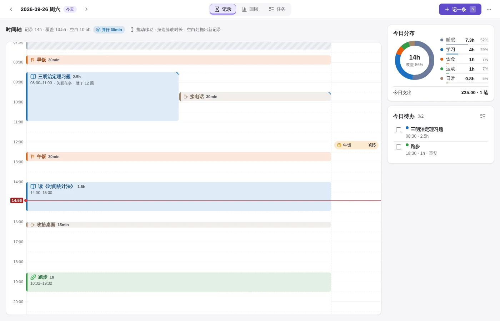

# Lubi 教学手册

> 适用版本：Lubi v1.4.0 ｜ 读完约 15 分钟，跟着做完「第一周练习」就能用顺手。
> 截图用的是示例数据，你自己的界面会随记录内容变化。

Lubi 是一个 Obsidian 插件，用**柳比歇夫时间统计法**管理时间：做完一件事就记下「几点到几点、做了什么」，每周 / 每月回头算账，看时间到底花在哪儿，再据此安排明天。

整个插件只有三页：

| 页面 | 用途 | 一句话 |
|---|---|---|
| **记录** | 记下已经发生的时间 | 记一条 |
| **回顾** | 按周 / 月 / 年汇总 | 看一眼 |
| **任务** | 安排接下来要做的事 | 排一下 |

---

## 目录

1. [[#1. 打开 Lubi|打开 Lubi]]
2. [[#2. 认识界面|认识界面]]
3. [[#3. 记录页：记下时间|记录页：记下时间]]
4. [[#4. 任务页：安排明天|任务页：安排明天]]
5. [[#5. 回顾页：月末算账|回顾页：月末算账]]
6. [[#6. 记支出|记支出]]
7. [[#7. 数据存在哪里|数据存在哪里]]
8. [[#8. 设置|设置]]
9. [[#9. 快捷键速查|快捷键速查]]
10. [[#10. 第一周练习|第一周练习]]
11. [[#11. 常见问题|常见问题]]

---

## 1. 打开 Lubi

- 点左侧栏的 **沙漏图标 ⌛**（提示文字「Lubi 记录」）。
- 或 `Ctrl+P` 打开命令面板，输入 `Lubi`：

| 命令 | 作用 |
|---|---|
| `Lubi: 打开面板` | 打开 Lubi |
| `Lubi: 记一条` | 不开面板，直接弹出记录窗口 |
| `Lubi: 打开面板 · 记录页 / 回顾页 / 任务页` | 直接打开到指定页 |
| `Lubi: 打开今天的日记文件` | 打开今天的 Markdown 日记 |

> 小技巧：在 Obsidian「设置 → 快捷键」里搜 `Lubi: 记一条`，绑一个全局快捷键（比如 `Ctrl+Shift+L`），在任何笔记里都能随手记。

第一次打开（或数据是空的时候）会看到「三步上手」卡片，点「记第一条」就能开始，右上角 × 可以永久关闭。


---

## 2. 认识界面


顶栏分三块，**三个页签的位置固定不动**，切页时不会跳：

- **左**：`‹ 日期 ›`。记录页显示当前日期（今天会带「今天」徽标）；回顾页 / 任务页显示当前周期，如「回顾 · 9/21 – 9/27」。
- **中**：`记录 · 回顾 · 任务` 三个页签，也可以按 `1` `2` `3` 切换。
- **右**：`＋ 记一条`（快捷键 `N`），以及 `⋯` 菜单（打开日记文件 / 快捷键 / 设置）。

面板很窄时（例如放在侧栏），页签只显示图标，内容自动改成单列。

---

## 3. 记录页：记下时间



左边是当天的 **24 小时时间轴**：每条记录按开始时间落位，**高度 = 时长，颜色 = 分类**。右边是今日分布（环形图 + 覆盖率）、今日支出、今日待办。

### 3.1 记一条的五种方式

| 方式 | 怎么做 | 适合 |
|---|---|---|
| ① 按钮 | 点右上角 `＋ 记一条`，或按 `N` | 最常用 |
| ② 拖出来 | 在时间轴**空白处按住往下拖**出一段，松手 | 补记一段已知时间 |
| ③ 双击 | 双击时间轴空白处 | 从某个时刻开始记 |
| ④ 补记空白 | 鼠标移到一段空白上，点「记这段」 | 补上「时间黑洞」 |
| ⑤ 接着记 | 记录窗口里点「从 xx:xx 接着记」 | 连续做事时 |

### 3.2 记录窗口


从上到下：

1. **时间 / 支出** 切换（支出见 [[#6. 记支出|第 6 节]]）。
2. **分类**：点胶囊选，或按 `Alt+1…9`（胶囊上的小数字就是序号）。
3. **做了什么**：写标题。
4. **开始 ── 时长 ── 结束**：三者联动，改任一个另外两个会跟着变。时长旁边的 `min` 点一下可以切换成 `h`。
5. **快捷时长**：15min / 30min / 45min / 1h / 1.5h / 2h，当前值会高亮。
6. **从 xx:xx 接着记**：把开始时间设为上一条记录的结束时间。
7. `+ 关联待办`、`+ 备注`：需要时再点开。

按 `Enter` 或点「记下」保存。填得不对会在对应的框旁边提示，不会丢掉已填的内容。

### 3.3 一行快速记录（推荐）

在「做了什么」里**一行写完**，Lubi 会自动识别，并在下方提示「识别为 …」：

| 你输入 | 识别结果 |
|---|---|
| `9:00-10:30 学习 三明治定理` | 09:00 开始，90 分钟，分类「学习」，标题「三明治定理」 |
| `30min 跑步` | 30 分钟，标题「跑步」 |
| `1.5h 运动 游泳` | 90 分钟，分类「运动」，标题「游泳」 |
| `看书 1h30m` | 90 分钟，标题「看书」 |
| `45分钟 冥想` | 45 分钟，标题「冥想」 |
| `14:00 午饭` | 14:00 开始，标题「午饭」 |
| `23:00-01:00 睡眠 小睡` | 跨过午夜，120 分钟 |

规则：

- 时间段可以用 `-` `~` `到` `至` 连接，冒号中英文都可以。
- 时长支持 `min` / `分钟` / `h` / `小时` / `1h30m`。
- 分类名必须和你设置里的分类**完全一致**，而且后面还要有别的字。只写一个「学习」会被当成标题。
- 识别不出来就原样当标题，比如 `读《1984》`、`跑步 5km` 不会被误判。

### 3.4 补记「时间黑洞」


时间轴上**超过 30 分钟的空白**，鼠标移上去会出现虚线框和「记这段 · 起–止 · 时长」按钮，点一下就会打开记录窗口，时间已经填好。柳比歇夫法的关键就是让空白越来越少。

### 3.5 修改、移动、删除

| 操作 | 方法 |
|---|---|
| 编辑 | 点一下记录块 |
| 移动（时长不变） | 按住块身上下拖 |
| 改开始 / 结束 | 拖块的上边缘 / 下边缘 |
| 精细吸附 | 默认吸附 5 分钟；拖动时按住 `Shift` 为 1 分钟，按住 `Alt` 吸附到相邻记录的边缘 |
| 取消拖动 | `Esc` 或右键 |
| 撤销 | 松手后右下角提示框里有 6 秒的「撤销」 |
| 键盘微调 | 点选一个块后 `↑` `↓` 移动 5 分钟（`Alt` 为 1 分钟），`Shift+↑/↓` 改时长 |
| 删除 | 选中后按 `Delete`，或在编辑窗口里点左下角「删除」 |
| 复制到明天 | 鼠标悬停在块上，点出现的「复制到明天」按钮 |


### 3.6 看懂时间轴

- **斜纹块**：「背景时间」，默认是睡眠。它会显示并参与统计，但在视觉上降权，不跟学习、工作抢眼。哪些分类算背景时间可以在设置里改。
- **右上角蓝色小三角**：这条记录和别的记录时间重叠（并行）。标题栏的「并行 30min」徽标会告诉你重叠了多少，统计时不会重复计算。
- **红线**：现在的时间。
- **「↑ 还有 N 条 / ↓ 还有 N 条」**：上方或下方视野外还有记录，点一下滚过去。
- **右侧窄栏**：当天的支出记录。
- 块足够高时会多显示一行「时间 · 备注」。

### 3.7 右侧栏

- **今日分布**：各分类小时数和占比；环形图中间是总时长和覆盖率（记录覆盖了 24 小时中的多少）。
- **今日待办**：今天安排的任务。
  - 勾掉一个任务时，会顺手弹出记录窗口让你记下实际用时（可在设置里关闭）。
  - 鼠标悬停时出现 **▶**：点一下按「从上一条结束到现在」预填这件事，适合做完就记。
- **今日收尾**（21:00 以后出现）：今天的覆盖率、最大的一段空白、明天第一件事。睡前花 30 秒看一眼，补上漏记的，再看看明天做什么。

### 3.8 看其他日期

`‹` `›` 或键盘 `←` `→` 切换前一天 / 后一天，`T` 回到今天。历史日期同样可以拖动、补记、修改。

---

## 4. 任务页：安排明天


| 区域 | 内容 |
|---|---|
| 左上 **今天** | 今天的任务。底部输入框写标题后回车即可添加；勾选 = 完成 |
| 左下 **未安排** | 还没定日期的任务。点「日历+」按钮排到当天，或直接拖到右边日程上 |
| 右侧 **周日程** | 7 天 × 小时的日程表 |
| 底部 **项目** | 有子任务的任务会自动成为项目，显示进度和时间跨度 |

### 4.1 在周日程上排期

- **拖动任务块**：上下拖改时间，左右拖换一天，拉下边缘改预计时长（吸附 15 分钟，`Esc` 取消）。
- **从左侧拖过来**：拖到某个时刻 = 定时任务；拖到表头 = 全天任务。
- **双击空白**：在那个时刻新建任务。
- 排期后同样有「撤销」。

### 4.2 负载条：别把一天排太满

每天的表头下有一根细条：**这天未完成任务的预计时长 ÷ 每日可用小时**（默认 8 小时，可在设置里改）。

- 绿色：正常
- 橙色：≥ 90%，快满了
- 红色：超过 100%，排太满了，挪一些到别的日子

鼠标悬停可以看到具体数字，例如「计划 3.5h / 可用 8h」。

### 4.3 编辑任务


- **分类、标题**。
- **重复**：不重复 / 每天 / 每周（选周几）/ 每月（选几号）。重复任务每次勾选只完成当天那一次。
- **安排日期、开始时间**：不填开始时间就是全天任务。
- **预计**：可以写 `2.5h`、`90min`、`1h30m` 或纯数字（分钟），右边会换算成分钟给你确认。
- `+ 父任务`：挂到某个项目下面。`+ 项目跨度`：设置项目的开始和截止日期。`+ 备注`。
- **状态**：待办 / 进行中 / 已完成，**受阻** 是一个独立开关（例如在等别人）。
- 标题旁出现「● 未保存」表示有改动没保存；点「取消」不会写入，点「保存」或按 `Enter` 才写入。

### 4.4 项目

项目区默认折叠，折叠时也会显示各项目的名称和进度条。展开后可以看到：

- 每个项目的 `完成数 / 总数` 和子任务列表；
- **极简甘特条**：整条左右拖 = 平移日期，拖两端 = 改跨度，拖动时会实时显示「起 → 止 · N 天」。

---

## 5. 回顾页：月末算账


右上角切换 **周 / 月 / 年**，`‹ ›` 切换上一期 / 下一期，「本期」回到当前。

### 5.1 指标卡

- **记录总时长**（大卡）：下面会显示和上一期相比多了还是少了多少。只有两期都有足够多的有效记录天数（周 ≥ 2 天、月 ≥ 5 天、年 ≥ 14 天），而且没有待校对的异常日时才显示，避免拿不完整的数据下结论。
- **有记录的天数**、**日均记录**（有异常日时显示「有效日均」，异常日不计入）。
- **覆盖率**：有记录的那些天里，记录覆盖了 24 小时的多少。
- **支出**。

### 5.2 异常提示

如果某天的记录跨出了当天，或者单日加起来超过 24 小时，页面顶部会出现一行橙色提示，后面跟着「校对 某日期」按钮，点一下直接跳到那天去修。柱状图上对应的柱子也会标 ⚠。

### 5.3 每日记录时长图

- 每根柱子是一天（年视图里是一个月），按分类堆叠。**睡眠这类背景时间固定在最底层**，方便比较上面的「有效时间」。
- 虚线 = 本期日均。
- 鼠标悬停或键盘聚焦时显示各分类的小时数；**点柱子跳到那天**（年视图里点某个月进入该月）。
- 「表格」按钮可以切换成表格，数字更精确，也方便读屏软件。

### 5.4 年热力图


年视图下多一张全年覆盖热力图：每个小格是一天，**颜色越深 = 那天记录覆盖得越多**。橙色描边 = 有待校对的记录，黑框 = 今天。点任意一格跳到那天。坚持得怎么样，一眼就能看出来。

### 5.5 明细

- **按分类**：各分类小时数和占比。
- **事项 Top 10**：花时间最多的 10 件事，带次数和比例条。
- **支出**：按类别汇总，外加最近 30 笔。

> 柳比歇夫的做法：每月末花半小时看回顾页，问自己三个问题：时间主要去了哪？和我想要的一致吗？下个月要调整什么？

---

## 6. 记支出

在记录窗口顶部切换到 **支出**：填时间、金额、类别（餐饮、交通……类别可在设置里改）、标题。支出会显示在时间轴右侧的窄栏、今日支出，以及回顾页的「支出」卡片里。

---

## 7. 数据存在哪里

**所有数据都是保险库里的普通文件，可读、可手写、可同步**，不依赖任何云服务。

### 7.1 时间记录：`日记/YYYY-MM-DD.md`

每天一个 Markdown 文件。Lubi **只管理 `## 记录` 这一节**，其他地方你随便写（比如随笔、心得）：

```markdown
---
date: 2026-09-26
---

# 2026-09-26

## 记录
- 09:00–10:30 学习 · 三明治定理 [时长:: 1.5h]
- 12:10 财务 · 午饭 [金额:: 35] [类别:: 餐饮]
- 20:00–20:45 运动 · 跑步 [时长:: 45min] [备注:: 5 公里]

## 随笔
今天状态不错。
```

一行的格式：`- 开始[–结束] 分类 · 标题 [字段:: 值]…`

- 时长可写 `1.5h` 或 `90min`；没写 `时长` 字段时按起止时间算。
- 可选字段：`[备注:: …]`、`[任务:: 任务 id]`；支出用 `[金额:: …] [类别:: …]`。
- 在文件里手写一行并保存后，面板会自动刷新。
- 这些是 Dataview 内联字段，可以用 Dataview 自己写查询。
- 跨过午夜的记录会自动拆成两天，各记在各自的日记里。

### 7.2 任务：`任务/任务数据.json`

所有任务存在一个 JSON 文件里（schema v14）。一般不需要手动改；要改的话请先关掉 Obsidian，并保证 JSON 格式正确。

### 7.3 插件设置：`.obsidian/plugins/lubi/data.json`

删掉这个文件等于恢复默认设置。

---

## 8. 设置

`⋯` → **设置**，或在 Obsidian「设置 → 第三方插件 → Lubi」里打开：

| 设置项 | 说明 |
|---|---|
| 日记文件夹 / 任务数据文件 / 备份文件夹 | 数据文件放在哪里 |
| 日程显示时段 | 任务页周日程显示的小时范围，默认 6–24 点 |
| 勾掉任务时顺手记一条 | 完成任务后自动弹出记录窗口 |
| 每日可用小时 | 负载条的分母，默认 8 |
| 晚间「今日收尾」卡片 | 21:00 后是否显示 |
| **分类** | 名称、图标（lucide.dev 上的图标名）、颜色、时间或金钱、是否算背景时间 |
| 支出类别 | 餐饮、交通等 |
| 迁移旧版数据 | 把旧格式的日记转换成新格式 |
| 重新显示上手引导 | 再看一次「三步上手」 |

> 颜色提示：如果某个分类的颜色和主题强调色（按钮、当前页签用的颜色）太接近，设置页会给出提醒，建议换一个颜色，免得分不清「数据」和「按钮」。

---

## 9. 快捷键速查

在 Lubi 面板里按 `?` 随时查看：


| 按键 | 作用 |
|---|---|
| `N` | 记一条 |
| `1` / `2` / `3` | 切换 记录 · 回顾 · 任务 |
| `T` | 记录页回到今天 |
| `←` / `→` | 记录页前一天 / 后一天 |
| `?` | 打开快捷键速查 |
| `↑` / `↓` | 时间轴：选中块移动 5 分钟（`Alt` 为 1 分钟） |
| `Shift` + `↑` / `↓` | 时间轴：改时长 |
| `Enter` / `Delete` | 时间轴：编辑 / 删除选中块 |
| `Alt` + `1…9` | 记录窗口：切换分类 |
| `Enter` | 记录 / 任务窗口：保存 |
| `Esc` | 取消拖动 / 关闭窗口 |

> 这些单键快捷键只在 **焦点位于 Lubi 面板内** 时生效，在别的笔记里打字不会误触。

---

## 10. 第一周练习

养成记录习惯比把功能用全更重要。建议这样开始：

| 天 | 练习 | 用到的功能 |
|---|---|---|
| 第 1 天 | 每做完一件事就按 `N` 记一条，不求完整 | 记一条、快捷时长 |
| 第 2 天 | 试试一行写完：`9:00-10:30 学习 xxx` | 一行快速记录 |
| 第 3 天 | 睡前打开记录页，把空白用「记这段」补上 | 补记空白、今日收尾 |
| 第 4 天 | 在任务页建 3 个明天的任务，拖到日程上，写上预计时长 | 任务页、负载条 |
| 第 5 天 | 做任务时点 ▶ 开始，做完勾掉，对比预计和实际用时 | ▶ 开始、勾选记用时 |
| 第 6 天 | 把一个大目标建成项目，下面挂几个子任务 | 项目、甘特条 |
| 第 7 天 | 打开回顾页看这一周：时间去了哪？哪天覆盖率最低？ | 回顾页、周视图 |

一周后，把分类调整成适合你的样子（设置 → 分类），就可以长期用下去了。

---

## 11. 常见问题

**Q：左侧栏没有沙漏图标？**
确认 Obsidian「设置 → 第三方插件」里 Lubi 已启用，且没有开启「受限模式」。然后 `Ctrl+P` → 「Reload app without saving」重载一次。

**Q：按 N、1、2、3 没反应？**
先点一下 Lubi 面板，让焦点在面板内，单键快捷键只在面板里生效。如果当前正在输入框里打字，快捷键也不会触发。

**Q：两条记录时间重叠了会怎样？**
允许重叠（比如边吃饭边听课）。统计总时长时重叠部分只算一次，时间轴上会标出并行角标。

**Q：回顾页显示「待校对」是什么意思？**
有记录跨出了当天，或者单日合计超过 24 小时，多半是手误（比如把 1.5h 写成了 15h）。点「校对」跳过去修正即可。

**Q：记录能在手机上用吗？**
数据是普通 Markdown，手机端 Obsidian 同步后可以直接看、直接编辑。插件界面对窄屏和触屏做了适配（例如补记按钮在触屏上常显）。

**Q：怎么备份？**
备份整个保险库文件夹即可，所有数据都在 `日记/`、`任务/` 和 `.obsidian/plugins/lubi/data.json` 里。用 git 管理也可以。

**Q：想从头再来？**
关闭 Obsidian，删除 `日记/` 里的文件，把 `任务/任务数据.json` 改成 `{"version": 14, "tasks": []}`，删除 `.obsidian/plugins/lubi/data.json`，再重新打开。

---

*开发与构建说明见 [[docs/mcp-lubi-plugin|docs/mcp-lubi-plugin.md]]。*
