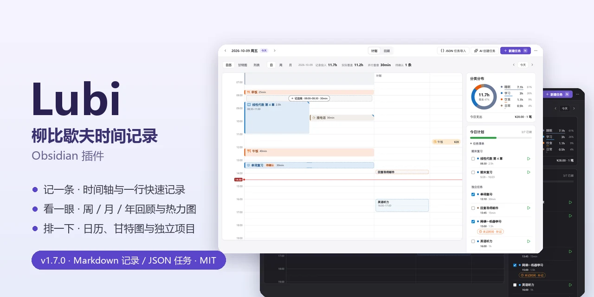
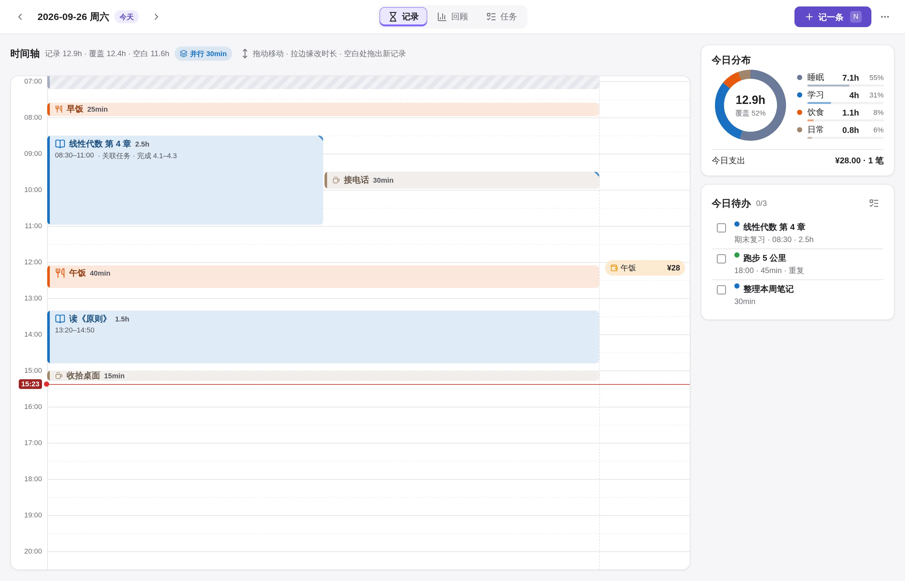
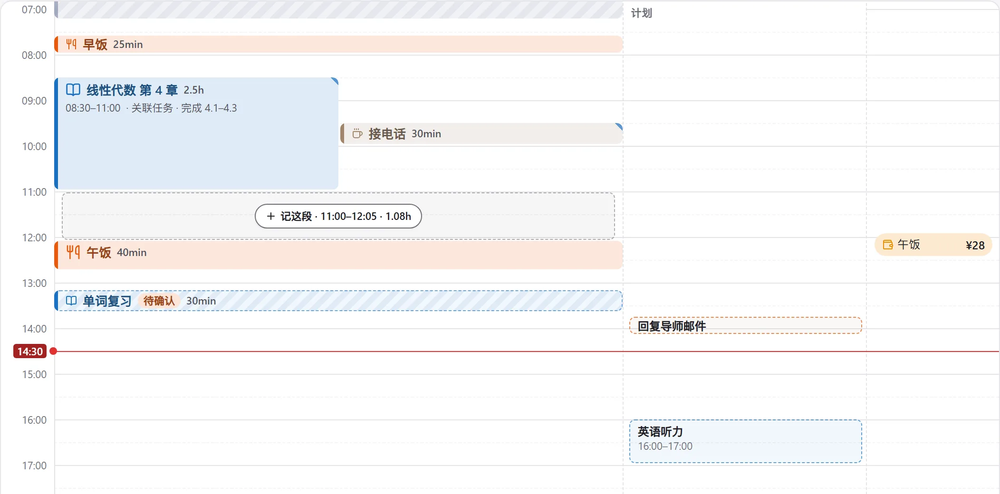
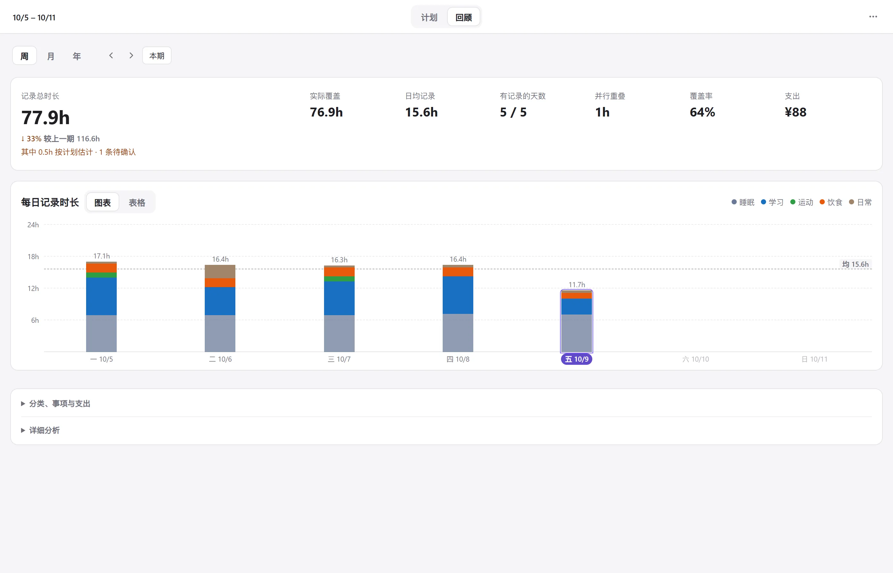
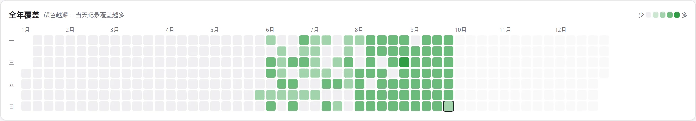
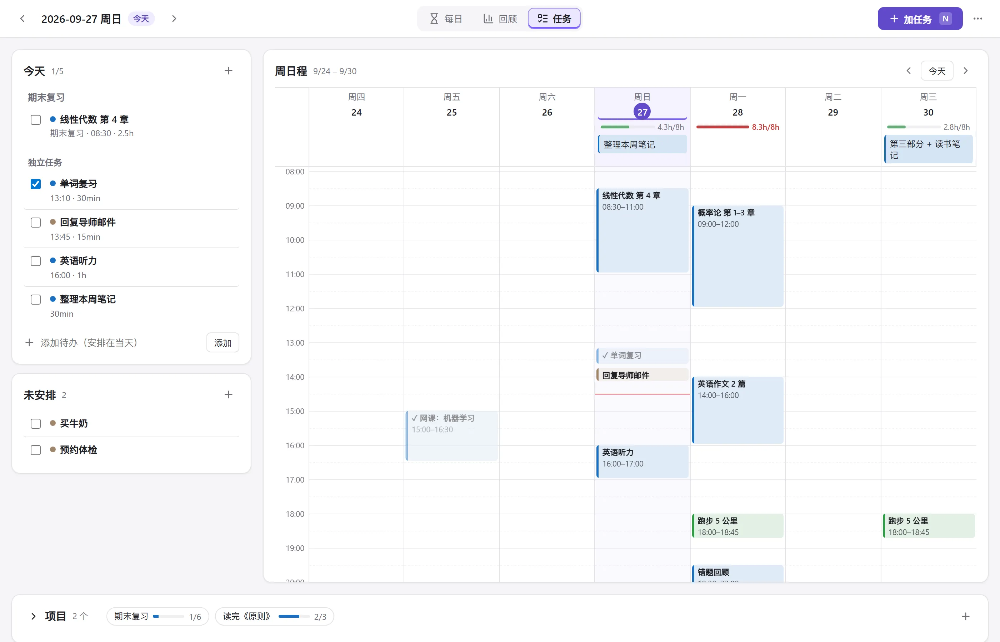
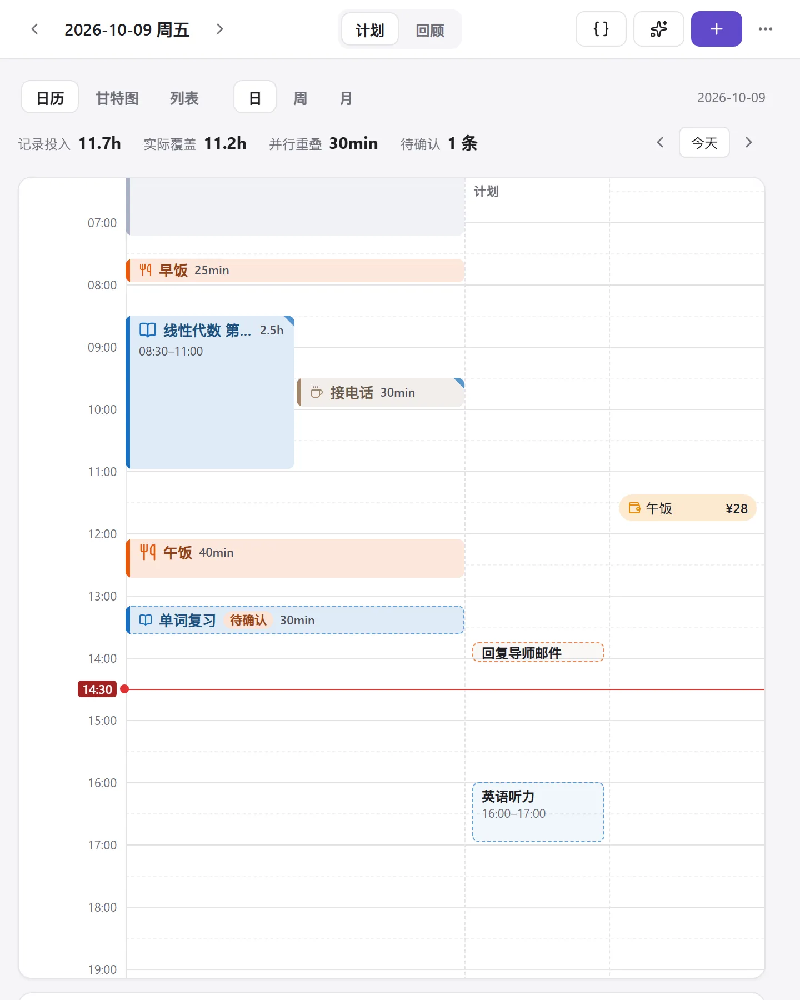
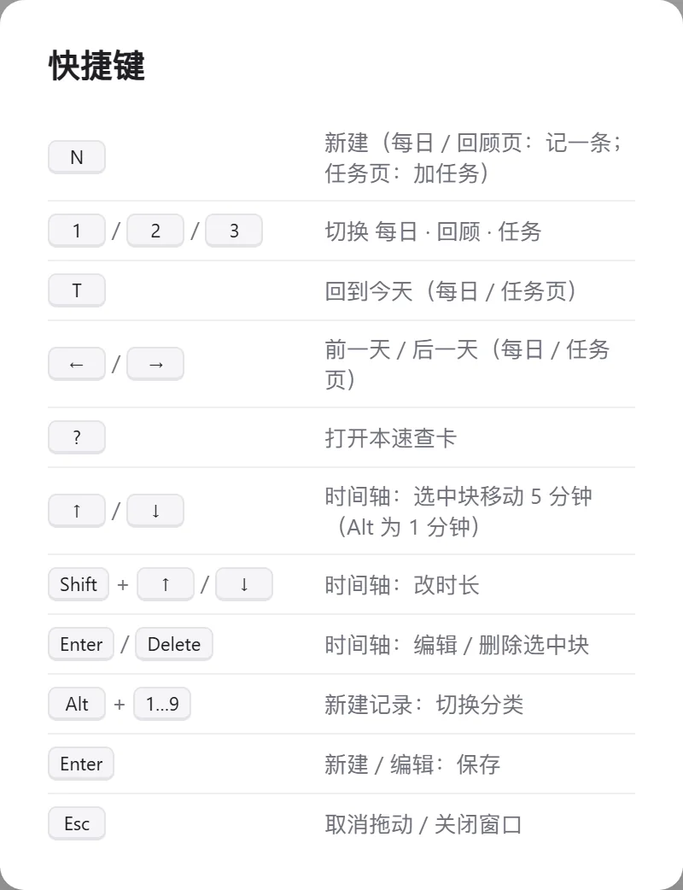
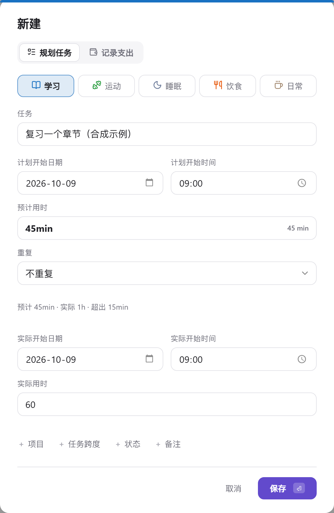

<p align="center">
  
</p>

<p align="center">
  <b>Lubi</b> —— 在 Obsidian 里践行柳比歇夫时间记录法：<b>记一条、看一眼、排一下</b>。<br>
  <sub>A Lyubishchev-style time tracker, review dashboard and weekly planner for Obsidian. Records stay in Markdown; tasks use JSON.</sub>
</p>

<p align="center">
  
  <a href="https://github.com/HP-Patience/obsidian_task_kanban/releases/latest"></a>
  
  
  <a href="LICENSE"></a>
</p>

---

这个仓库是一个**开箱即用的 Obsidian 仓库（vault）**，核心是自研插件 **Lubi**：

- **计划**：日历 / 甘特图 / 列表均支持日 / 周 / 月；默认打开今天的日历日视图，在同一处对照实际记录和计划、查看分类分布与进度，管理未安排任务；
- **回顾**：按周 / 月 / 年汇总，查看分类占比、事项 Top 5、支出和全年覆盖热力图。
- **名称复用**：规划任务和记录时间可按分类选择历史名称，输入文字实时筛选；列表最多露出 5 行，其余滚动查看，最近使用顺序重启后保留。

> [!NOTE]
> 截图全部使用合成演示数据，不含真实个人记录。部分总览图保留旧版示例；当前界面已收拢卡片，分类分布常驻侧栏顶部，空白时段默认展开，明细和分析按需展开。预计对比图展示 v1.6 的记录窗口。

**当前仓库及随仓库分发的安装版：v1.7.0。** 任务数据初始化为空，个人日记和 AI 设置不随仓库分发。GitHub Release 独立发布，不会因代码推送自动生成。变化见 [更新日志](CHANGELOG.md)，维护入口见 [文档索引](docs/README.md)。

## 目录

- [界面一览](#界面一览)
- [功能](#功能)
- [项目与任务](#项目与任务)
- [界面与提示](#界面与提示)
- [预计与实际](#预计与实际)
- [AI 与隐私](#ai-与隐私)
- [安装](#安装)
- [快速上手](#快速上手)
- [数据格式](#数据格式)
- [开发](#开发)
- [仓库结构](#仓库结构)
- [致谢与许可](#致谢与许可)

## 界面一览

### 日历日视图 · 时间轴

<picture>
  <source media="(prefers-color-scheme: dark)" srcset="docs/images/today-dark.webp">
  
</picture>

日历日视图默认显示今天，也可切换日期查看其他天：左边是当天的时间轴，拖动色块改时间，拉边缘改时长，在左侧记录区空白处拖出新记录；右侧计划列显示时，在其空白处拖选默认新建计划，日期、开始时间和预计用时自动带入；并行的事情（比如学习时接了个电话）会自动分栏。定了开始时间的任务画在时间轴右侧的虚线「计划」列，点击打开规划任务编辑；实际记录使用任务清单的 ▶ 按钮。右边的分类分布在顶部直接显示，当天计划在下方独立卡片中展示已做数量和进度条，默认展开的下拉清单按开始时间列出当天全部任务，未定时任务放在最后；空白时段默认展开，可点击收起。拖选的蓝色计划区域遮住区域内的当前时间红线，区域外红线和左侧时间标签仍保留。记录投入与实际覆盖等摘要放在日历日视图切换栏的日期后面，不再独占一行；侧栏不会因滚动条出现或消失而左右跳动。

| 补记空白 | 一行快速记录 |
| :---: | :---: |
|  |  |
| 两条记录之间空出 ≥ 30 分钟时，悬停即可「记这段」 | 输入 `9:00-10:30 学习 三明治定理`，实时预览解析结果 |

### 回顾页 · 周 / 月 / 年

<picture>
  <source media="(prefers-color-scheme: dark)" srcset="docs/images/review-week-dark.webp">
  
</picture>

回顾页右上角仅保留更多菜单，不显示新建任务按钮；创建任务请回计划页或使用原快捷键。KPI 卡片只在两期都有足够记录时才显示环比，避免「少记一天就像效率暴跌」的误导；柱状图可切换为表格，睡眠用斜纹淡化，不喧宾夺主。



### 计划页 · 周日程

<picture>
  <source media="(prefers-color-scheme: dark)" srcset="docs/images/tasks-week-dark.webp">
  
</picture>

周日程显示以今天为中心的连续 7 天（前 3 天 · 今天 · 后 3 天），左右箭头每次翻 7 天、「今天」一键回到中间。把任务拖到时间格里即可排期（15 分钟吸附）；每天顶部的负载条对比「预计时长 / 每日可用时长」，≥ 90% 变橙、超过 100% 变红，提醒你别把一天排爆。

### 窄栏与快捷键

| 窄栏（侧边栏 / 分屏） | 快捷键（面板内按 `?`） |
| :---: | :---: |
|  |  |

## 功能

**每日**
- 时间轴拖拽：移动、改时长；左侧空白处拖出记录，右侧计划列空白处拖出计划。悬停和选区限制在对应区域，并行记录自动分栏
- 一行快速记录：`9:00-10:30 学习 标题`、`30min 跑步`、`1h30m 看书`、`14:00 午饭`（需补填实际用时）等写法支持快速录入
- 空白补记、「接上一条」一键填入开始时间、`Alt+1…9` 切换分类
- 支出记录（金额 + 类别），与时间记录同一条时间线
- 关联任务记录保存预计用时快照，记录窗口和时间轴详情显示预计 / 本条实际 / 偏差；旧记录不补算
- 日历日视图计划块可上下拖动改开始时间、拉两端改预计时长；5 分钟吸附，Shift 精确到分钟，Esc 取消，修改可撤销，且不会自动生成实际记录
- 并行时长单独统计；跨过当天 24:00 的异常记录标记为「待校对」，不参与环比，并提供一键校对入口
- 计划列：当天定了时间的任务以虚线块叠在时间轴旁，点击编辑规划任务；过了计划时间仍未记录的计划会标橙
- 在计划页勾选完成时按计划时间自动记一条，标为「待确认」（虚线 + 徽标，日记里是 `[待确认:: 按计划]`）；拖到实际时间、在表单里保存或点击时间轴上的「待确认」标签后转为实际记录，回顾页会单独提示待确认的时长。取消勾选会把那条记录一起移除（可撤销），反复勾选不会重复记
- 右栏「空白时段」：列出最长的几段空白，点击定位或直接补记

**回顾**
- 周 / 月 / 年切换，KPI：记录总时长、有记录的天数、日均、覆盖率、支出
- 堆叠柱状图 ⇄ 表格，平均线；点击柱子打开当天（年视图下钻到月）
- 按分类、事项 Top 5、支出明细，全年覆盖热力图

**计划**
- 今日待办 / 未安排清单，保留父子任务分组与起止日期；不再单独展示项目面板；未安排任务可直接拖到上方当天清单，安排为当天全天任务（可撤销）；清单支持同一项目分组内拖拽排序，顺序自动保存且不改排期
- 日历 / 甘特图 / 列表三种展示方式，共用日 / 周 / 月范围与日期导航。默认今天的日历·日，周视图为周一至周日；所有展示方式和周期均为主内容在左、已有任务侧栏在右；右侧统一为日历·日的 300px 宽度，面板宽度不超过 900px 时侧栏统一置于主内容下方并铺满可用宽度；切换方式不重置范围或日期，选择仅在本次面板打开期间保留。日历日 / 周固定显示 00:00–24:00，月为标准月历；空数据也保留坐标和日期。日历·日时间轴在左、摘要卡在右，呈现实际记录与计划对照、分类分布环形图及计划进度卡，清单默认展开、按时间排序，未安排任务入口保留。
- 重复任务：每天 / 每周（选周几）/ 每月（选几号）；可跳过某一次，不改变重复规则
- 绿色 ▶ 打开该任务的实际用时字段，实际值不拿预计来预填；保存成功后完成该次任务，取消或写入失败不完成，也不重复记账
- 可选 AI 创建：自然语言生成任务 / 后续任务草稿，逐项确认保存后才写入
- 日历日 / 周保留时间拖动、拉伸和空白选区创建；月历支持拖到其他日期，保留开始时间并整体移动已有跨度。甘特图日视图首行是 00:00–24:00 时间线，周 / 月按日期绘制任务跨度。列表按日期和开始时间排列，普通跨日任务只列一次，重复任务按发生日分别列出。
- 保留项目归属、规划编辑、拖动和撤销；周／月任务条可拉左右端调整日期范围；完成任务使用删除线和灰色任务条，不添加勾号，取消完成恢复分类色。未定时 / 未填预计不伪造时长，日期或时间规划操作不修改实际记录。窄屏在图内横向滚动，任务名称固定。
- 每日负载条（没排计划的日子不显示）；从任务直接「记一条」，记录自动关联任务

**体验**
- 亮色 / 暗色主题自动跟随 Obsidian，文字对比度 ≥ 4.5:1
- 更多菜单 / 命令面板可「导出数据 JSON」，包含任务（预计、排期、重复、项目归属与完成状态）以及实际时间 / 支出记录（预计快照、自定义字段）。文件仅保存在 Vault 根目录，不包含插件设置或 AI 密钥；导出格式不是「JSON 任务导入」的追加格式，目前没有一键恢复入口。任务仍存 JSON，实际记录仍存 Markdown，不因导出迁移。
- 每日和回顾摘要区分记录投入、实际覆盖和并行重叠
- 键盘优先：`N` 在各页打开统一任务表单；窗口只切换「规划任务 / 记录支出」，预计用于排期、实际用时用于完成，各入口共用同一新建任务视图，实际日期、时间与用时直接显示，不显示重复实际时长或留空说明小字，打开时不自动聚焦名称输入框；`1/2` 依次切换计划 / 回顾，`←/→` 翻天、`T` 回到今天、`?` 查看全部快捷键
- 窄至 320px 的布局适配；首次打开有引导
- 在日历日视图删除一条关联了任务的记录，计划页同步：一次性任务（没有别的记录关联它）一起删除；重复任务 / 项目只取消当天完成
- 拖拽改时间、删除记录、任务排期等操作可撤销；迁移旧版数据前自动备份

## 项目与任务

项目名保留在甘特图左侧任务列，下面任务缩进；项目行时间网格与任务行连续对齐。短任务条放不下完整标签时不显示数字，较宽任务条显示完整日期或用时；详细日期、预计用时仍在悬停里，拖动和缩放时自动重新判断。没有独立项目侧栏、筛选按钮或新导航。日 / 周 / 月甘特图按项目分组，项目标题没有任务条或完成操作，未选项目的任务归入「独立任务」。范围列表按日期和时间排序，项目归属只显示一次；未安排清单按项目分组；日历只在任务详情中显示项目，不增加月格文字。回顾仍按活动分类统计。 列表的日 / 周 / 月视图右侧与甘特图一致：上方是当前选中日的任务清单（计数、项目分组、完成 / 记录操作及快速添加），下方是未安排；左侧范围列表继续保留。切换日期时右侧跟随更新，其他日期显示日期标题而不是固定“今天”。

项目是归属容器，不是待办，不占用计划时间、不勾选完成、不计入当天进度。新建任务点「＋ 项目」，可选现有项目或在原窗口输入名称、点击「创建项目」；项目立即保存，取消任务不会删除已创建的项目。任务可以不属于项目；同项目任务也各自保存时间、状态和实际记录，不做完成联动。日历日视图的当天计划按项目分组，项目标题只显示一次，任务行不重复归属文字；保留完成进度、折叠和原任务操作。列表主区域仍按日期范围列任务并以小字显示项目。

旧父子关系不会自动改写。先把任务文件备份到仓库外，再在「设置 → 数据维护 → 旧父任务转为项目」确认转换：顶层父项成为项目，旧层级展平；纯分组父项保留存档数据及 ID，不再出现在任务清单；有计划开始、预计、明确任务跨度、重复规则或历史实际记录的父项仍保留为任务。转换还会在配置的备份文件夹保存原文件，失败不发布新状态；历史 Markdown 记录不改。请勿在修改任务时同时转换。

## 界面与提示

任务清单的 ▶ 对齐任务名称的首行，长标题换行或带时间信息时仍保持对齐；日历、甘特图和列表共用同一规则，触屏保留较大的点击区域。

常见按钮和已显示的文字不再重复弹提示，包括未安排的 ＋、编辑 / 删除图标、展开收起与翻期箭头、分类和模型下拉等。任务 / 记录详情、图表数据、统计口径及有特殊后果的操作仍保留说明。▶ 提示「填写实际用时，保存后完成任务」，补记提示「按计划补记一条待确认记录」；关闭普通提示不影响操作、快捷键或读屏名称。详细使用见 [教学手册](Lubi%20教学手册.md#统一悬停提示)。

## 预计与实际

表单按「计划开始日期 / 计划开始时间 → 预计用时 → 重复」及「实际开始日期 / 实际开始时间 → 实际用时」分组，实际信息直接显示，无折叠标题。新建统一使用任务表单，顶部只保留「规划任务 / 记录支出」，不再单独切换记录时间。实际用时留空只保存计划；填写后保存会完成任务并生成关联日记记录。未填写实际开始时标为待确认，不把计划开始当成真实发生时间。已有单条记录在同一任务表单中更新，不重复添加；多段或跨日记录继续在时间轴分别编辑。




例如任务预计 45 分钟、实际记录 1 小时，窗口会显示「预计 45min · 实际 1h · 超出 15min」，并在 Markdown 分别保存 `[时长:: 1h]` 与 `[预计用时:: 45min]`。预计值取自当次任务并保存为历史快照，后续调整任务不会改写它。修改实际时长或结束时间，对比实时更新。

- ▶ 不是实时计时器，预填的时长仍需按真实用时核对。
- 对比针对本条记录；同一任务分多条记录时，不要重复累加任务预计。累计任务偏差尚未实现。
- 无预计、无快照的旧记录不强行比较；自动生成的待确认记录核对后再比较。
- 计划日历的日 / 周网格固定显示 00:00–24:00；旧的日程显示时段设置已移除，兼容配置不再裁切规划网格。

## AI 与隐私

设置页的 AI 区域默认收起；模型只保留一个输入框，可手动填写或选择获取到的模型；获取成功、点击输入框或展开按钮时列出全部模型，仅主动输入文字时筛选，列表可滚动并跟随浅色 / 深色主题。获取模型不会更改当前选择。AI 是可选功能，默认接口为本地 Ollama 的兼容聊天地址；正常时间记录和任务管理不依赖 AI。可在设置的「JSON 任务导入」中复制系统提示词给外部 AI；拿到 JSON 后，点击顶部「AI 创建任务」左侧的「JSON 任务导入」，粘贴并导入，整批校验后一次新增，已有任务不覆盖，重复导入会新增重复任务。已有任务文件导入前会备份。点击计划页顶部「新建任务」左侧的「AI 创建任务」后，解析请求只发送当前描述、分类名和日期上下文，不扫描或上传整个 Vault。模型列表与测试连接也需手动触发。

> [!WARNING]
> 云端接口会收到你主动提交的描述。当前 API Key 随普通设置明文保存在本地 `.obsidian/plugins/lubi/data.json`，不是加密保管；不要提交、共享这个文件，Vault 同步也需自行检查。桌面 curl 网络兜底当前跳过 TLS 证书验证，仍待安全加固；AI 建议先用于可信的本地服务，不作云端生产安全保证。

新增的 Git 忽略规则覆盖个人日记、AI 设置、工作区状态、导出和备份；已被 Git 跟踪的旧配置不会因忽略规则自动停止跟踪。提交时仍应只选择源码、测试、文档及明确的分发文件。

## 安装

**方式一：直接使用本仓库（推荐）**

```bash
git clone https://github.com/HP-Patience/obsidian_task_kanban.git
```

用 Obsidian「打开文件夹作为仓库」选中克隆下来的目录，在 *设置 → 第三方插件* 里关闭安全模式即可。Lubi 和常用插件都已配置好。

**方式二：只装 Lubi 到你自己的仓库**

1. 从 [Releases](https://github.com/HP-Patience/obsidian_task_kanban/releases/latest) 下载 `main.js`、`manifest.json`、`styles.css`
   （如需仓库当前版本，直接拷贝本仓库的 `.obsidian/plugins/lubi/` 三个分发文件；Release 的版本以其说明为准）；
2. 放到你的仓库的 `.obsidian/plugins/lubi/` 目录下；
3. 重启 Obsidian，在 *设置 → 第三方插件* 中启用 **Lubi 柳比歇夫记录**。

> 需要 Obsidian ≥ 1.4.0。

## 快速上手

1. 点左侧栏的沙漏图标，或命令面板执行 **Lubi: 打开面板**；顶部按「计划 → 回顾」排列。
2. 在「计划 → 日历 → 日」按 `N`（或右上角「新建任务」），填名称与实际用时即可完成并记录；也可一行输入 `8:30-10:00 学习 线性代数`。
3. 在「计划」新建一个有预计用时的任务；做完后点 ▶，核对实际用时并保存，任务同步完成。
4. 到「回顾」选择周 / 月 / 年，比较记录投入、实际覆盖和分类分布。

完整教程见仓库根目录的 **[Lubi 教学手册](Lubi%20教学手册.md)**（在 Obsidian 里打开体验最好）。

## 数据格式

Lubi 不使用数据库，所有数据都是普通文件，可以用任何编辑器查看、用 git 管理，也能被 Dataview 查询。

**日记**：`日记/YYYY-MM-DD.md`，Lubi 只读写其中的 `## 记录` 一节，其余内容原样保留。

```markdown
---
date: 2026-09-26
---

# 2026-09-26

## 记录
- 08:30–11:00 学习 · 线性代数 第 4 章 [时长:: 2.5h] [任务:: demo-la] [备注:: 完成 4.1–4.3]
- 09:30–10:00 日常 · 接电话 [时长:: 30min]
- 12:10 财务 · 午饭 [金额:: 28] [类别:: 餐饮]
```

- 时间记录：`开始–结束 分类 · 事项 [时长:: …]`，可选 `[任务:: id]`、`[备注:: …]`、`[预计用时:: 45min]`
- 预计用时保存任务当次的计划快照；记录窗口和时间轴详情可对比本条实际用时。历史记录不补算，任务后续修改不会改变快照；预计不参与实际时长统计，同一任务的多条记录不要重复累加预计。
- 支出记录：`时刻 财务 · 事项 [金额:: …] [类别:: …]`
- 默认分类：学习 / 运动 / 睡眠 / 饮食 / 日常 / 财务，可在设置里增删改色

**任务**：`任务/任务数据.json`（schema v14：任务、项目、排期、重复规则）。仓库模板的任务数组为空。清空该数组只清除任务 / 项目 / 重复规则，不删除日记中的实际记录或预计快照；操作前先备份，参见教学手册第 7 节。

日记文件夹、任务文件路径、每日可用时长等都可以在插件设置里修改。

**重新开始使用**：关闭 Obsidian，先把任务文件和日记备份到仓库外。只清空任务不会清空实际记录；完整初始化还需清除日记「记录」节中的时间 / 支出记录，以及本地设置的历史名称列表 `nameUses`。保留日记其他章节、分类和 AI 配置；不要把含密钥的设置文件作为空模板提交。具体步骤见教学手册第 7.5 节。

## 开发

插件源码在 `插件源码/lubi/`（TypeScript + esbuild，无运行时依赖）。

```bash
cd 插件源码/lubi
npm ci           # 按锁文件安装；Node/npm 版本以依赖 engines 为准
npm run dev      # 监听构建
npm run build    # 类型检查 + 压缩生产构建（保留类名），输出 main.js
npm test         # 核心逻辑 + 冒烟测试 + 布局回归
```

- 优先在独立测试 Vault 验证；不要用个人日记做自动化测试。
- 本仓库是可直接打开的 Vault，已有 `.obsidian/plugins/lubi/` 分发文件随仓库跟踪；源码目录中的生成物仍忽略。发布前同步三个文件并核对哈希，之后在 Obsidian 禁用再启用 Lubi 或重启。
- Windows PowerShell 可设置 `$env:LUBI_OUT` 为测试插件目录后运行 `npm run build`；不提交具体本机路径。
- 生产包验证：构建并运行核心测试后，PowerShell 设置 `$env:LUBI_TEST_PLUGIN="../main.js"`，再执行 `node test/smoke.mjs` 和 `node test/ui-interactions.mjs`，验证实际生产包。
- 布局回归测试需要 Chrome / Edge，设置环境变量 `LUBI_BROWSER` 指向浏览器可执行文件，否则自动跳过；正式验证同时设置 `LUBI_REQUIRE_BROWSER=1`，避免把跳过当通过；
- README 与教学手册的截图由演示数据生成：`node test/preview-manual.mjs` 渲染静态预览页，再运行 `python scripts/screenshots.py` 截图（依赖 Playwright + Pillow，详见脚本开头）。

## 仓库结构

```text
.
├── AGENTS.md                 # 开发约定与数据 / 发布红线
├── CHANGELOG.md              # 当前版本变更与已知限制
├── Lubi 教学手册.md          # 使用教程（Obsidian 中打开）
├── 日记/                     # 每日记录（Lubi 自动创建）
├── 任务/任务数据.json         # 任务与项目
├── 附件/lubi手册/             # 教学手册配图
├── 插件源码/lubi/             # Lubi 插件源码
│   ├── src/core/             #   纯逻辑：记录解析、统计、任务、迁移
│   ├── src/ui/               #   视图：记录 / 回顾 / 任务 / 弹窗
│   ├── styles.css
│   └── test/                 #   测试、演示数据与预览
├── docs/                     # 设计与维护文档、README 配图
└── .obsidian/                # 仓库配置与已安装插件
    └── plugins/lubi/         #   Lubi 构建产物
```

## 致谢与许可

- 灵感来自苏联生物学家 **亚历山大·柳比歇夫** 坚持 56 年的时间统计法（《奇特的一生》）。
- 交互上借鉴了 Toggl、Timing、Sunsama、Amie 等优秀产品的做法（时间轴补记、负载提醒、自然语言快速添加）。
- `.obsidian/plugins/` 中的第三方插件（Dataview、Templater、QuickAdd、Kanban、Style Settings 等）版权归各自作者所有，遵循其各自的许可证，此处仅作为仓库配置的一部分分发。

Lubi 插件源码与本仓库文档以 [MIT License](LICENSE) 发布。
